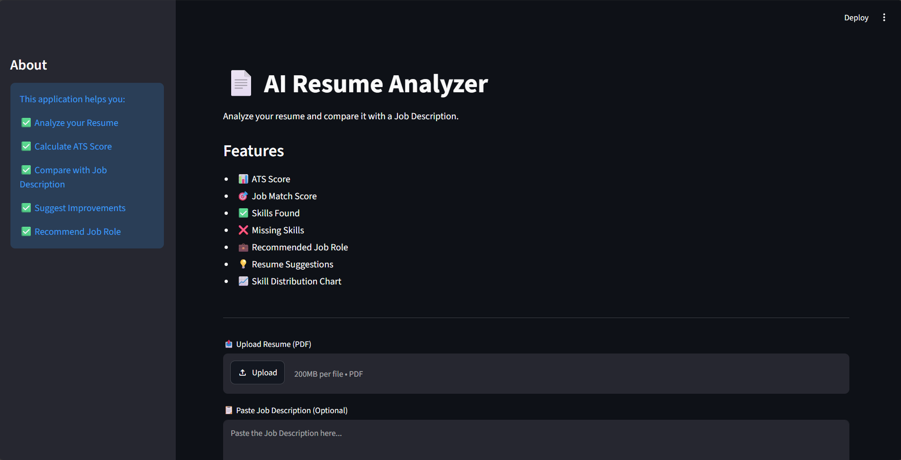
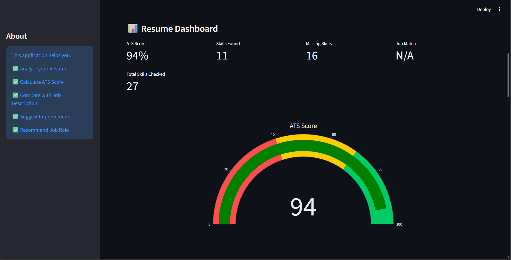
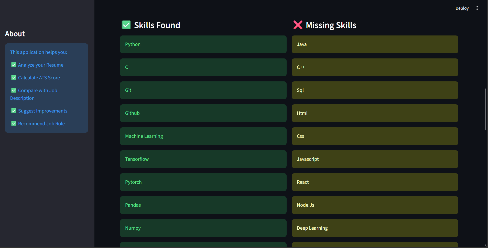
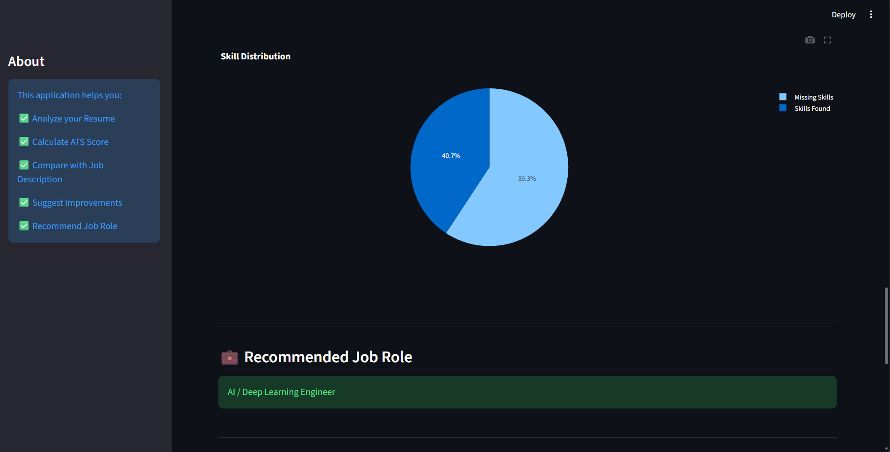
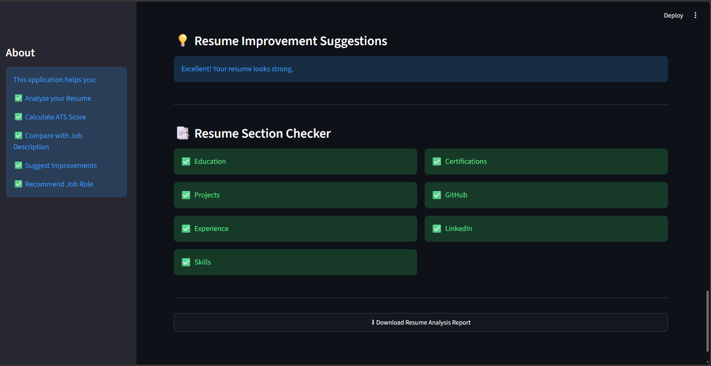

# 📄 AI Resume Analyzer

An AI-powered Resume Analyzer built using **Python** and **Streamlit** that evaluates resumes, calculates an ATS score, detects technical skills, compares resumes with job descriptions, and provides personalized improvement suggestions through an interactive dashboard.

---

## ✨ Features

- 📄 Upload Resume (PDF)
- 📊 ATS Score Calculation
- 🎯 Job Description Match Score
- ✅ Skills Detection
- ❌ Missing Skills Identification
- 📈 ATS Score Gauge Chart
- 🥧 Skill Distribution Chart
- 💼 Recommended Job Role
- 💡 Resume Improvement Suggestions
- 📋 Resume Section Checker
- 📥 Download Resume Analysis Report
- 🎨 Clean and Interactive Streamlit UI

---

## 🛠️ Tech Stack

| Technology | Purpose |
|------------|----------|
| Python | Backend Logic |
| Streamlit | Web Application |
| Plotly | Interactive Charts |
| PyMuPDF (fitz) | PDF Text Extraction |
| Regular Expressions (re) | Skill Detection |
| Pandas | Data Processing |

---

## 📂 Project Structure

```text
AI-Resume-Analyzer/
│
├── app.py
├── score.py
├── resume_utils.py
├── requirements.txt
├── README.md
├── images/
│   ├── home.png
│   ├── dashboard.png
│   ├── skills.png
│   ├── skills_distribution.png
│   └── suggestions.png
│
└── sample_resume.pdf
```

---

## ⚙️ Installation

### Clone the Repository

```bash
git clone https://github.com/asad976/AI-Resume-Analyzer.git
```

### Navigate to the Project Folder

```bash
cd AI-Resume-Analyzer
```

### Create a Virtual Environment

**Windows**

```bash
python -m venv venv
venv\Scripts\activate
```

**Mac/Linux**

```bash
python3 -m venv venv
source venv/bin/activate
```

### Install Dependencies

```bash
pip install -r requirements.txt
```

---

## ▶️ Run the Application

```bash
streamlit run app.py
```

---

## 📖 How It Works

1. Upload a resume in PDF format.
2. The application extracts text from the resume.
3. Technical skills are detected.
4. ATS score is calculated.
5. The resume is compared with the Job Description (optional).
6. Personalized improvement suggestions are generated.
7. A recommended job role is displayed.
8. Interactive charts visualize the analysis.

---

## 📊 ATS Score Calculation

The ATS score is calculated based on:

- Technical Skills
- Projects
- Education
- Experience / Internship
- Certifications
- GitHub Profile
- LinkedIn Profile
- Resume Length

**Maximum Score:** **100**

---

# 📷 Screenshots

## 🏠 Home Page



---

## 📊 Resume Dashboard



---

## 🧠 Skills Analysis



---

## 🥧 Skill Distribution



---

## 💡 Resume Suggestions



---

## 🚀 Future Improvements

- 🤖 AI-powered resume suggestions using Gemini/OpenAI
- 📄 Resume keyword optimization
- 📂 Support for DOCX resumes
- 📑 Download analysis as a PDF report
- 📊 Resume ranking system
- 🌙 Dark/Light mode
- ☁️ Cloud deployment
- 🔐 User authentication

---

## 🤝 Contributing

Contributions are welcome!

1. Fork this repository.
2. Create a new branch.
3. Commit your changes.
4. Push the branch.
5. Open a Pull Request.

---

## 👨‍💻 Author

**Mohammed Asad**

- **GitHub:** https://github.com/asad976
- **LinkedIn:** https://www.linkedin.com/in/mohammed-asad-655916406/

---

## ⭐ Support

If you found this project useful, please consider giving it a **⭐ Star** on GitHub!